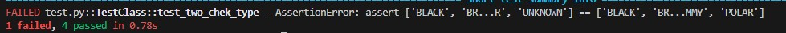

# **Тестирование проекта с помощью docker+pytest**

Для запуска программы необходимо:
1) Скачать докер-образ: https://hub.docker.com/r/azshoo/alaska
2) Скопировать программу с GitHub: git clone https://github.com/SoDDanil/testEVM

## **Настройки перед запуском**
Для работы с программой необходимо установить все необходимые библиотеки которые находятся в файле 'requirements.txt', для этого необходимо создать виртуальное окружение и написать в консоль 'pip install -r requirements.txt'
В файле const_data.py необходимо в переменной 'URL' указать свой порт, который вы задали в докере
При запуске файла test.py будет вызвана функция из файла main.py (функция удалит все старые данные и внесет новые для тестирования)

Пример данных, которые будут записаны для первого медведя:
**"bear_type":'POLAR'
"bear_name":"mikhail"
"bear_age":17.5**

### **Запуск тестов**

Для запуска тестов необходимо написать в консоль команду 'pytest -q test.py', перед каждый новым запуском тестов будет запускаться функция из файла main.py

После прохождения тестов должно вывестись сообщение

В моем примере пройдено четыре теста и не пройден один.

Не пройден тест номер 2 (функция test_two_chek_type), так как не добавляется медведь с типом 'GUMMY'. Ожидаемый результат что добавилось 4 типа медведей('POLAR', 'BROWN', 'BLACK','GUMMY'), а вместо 'GUMMY' добавляется 'UNKNOWN'.

### **Стратегия тестирования**
Для начала можно протестировать все возможные типы данных, записать строки или массивы в переменные "bear_age", или попробовать в "bear_type" поместить число. В дальнейшем можно протестировать весь функционал сервиса, попробовать добавить медведя или обновить его данные и посмотреть получилось ли добавить изменение.
В моем примере у меня 5 тестов:
1) Тест который проверяет что добавилось 4 новых сущности (медведя), я проверяю это с помощью подсчета количества новых id
2) Проверка типов медведей, проверяет что все новые медведи имеет все возможные типы (я создал 4 медведей с 4 разными типами).Тест выдаёт ошибку так как тип "GUMMY" не добавляется.
3) Проверяем что мы добавли нового медведя, для проверки мы сравним данные которые мы хотим добавить с данными которые получились после добавления 
4) Проверим что мы можем обновить имя у медведя, логика проверки как и в прошлом тесте, проверим что новое имя равно тому которое мы хотели добавить 
5) Удалим медведя по id, для проверки просто сравним что длина массива id стала на 1 меньше